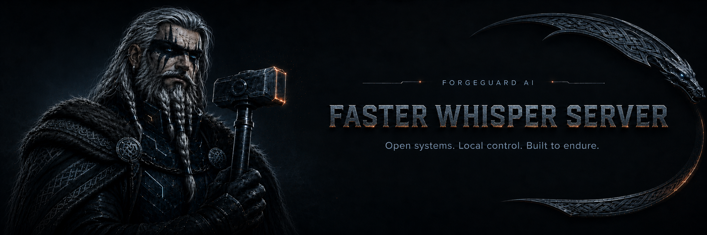
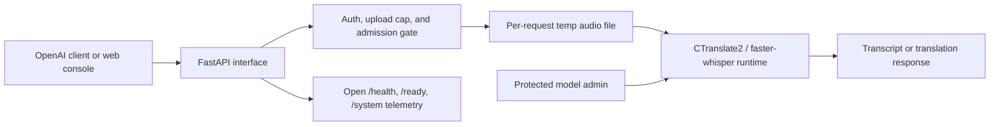

<div align="center">
  
</div>

<div align="center">

<a href="./docs/site/index.md"></a>
<a href="https://github.com/forgeguard-ai/faster-whisper-server/releases"></a>
<a href="https://github.com/orgs/forgeguard-ai/packages?repo_name=faster-whisper-server"></a>
<a href="./LICENSE"></a>
<a href="./SECURITY.md"></a>

**A container-native, OpenAI-compatible speech-to-text server built on faster-whisper and CTranslate2 — for teams that want to run transcription on their own GPUs, under their own control.**

[Quick start](#quick-start) ·
[Documentation](./docs/site/index.md) ·
[Releases](https://github.com/forgeguard-ai/faster-whisper-server/releases) ·
[Packages](https://github.com/orgs/forgeguard-ai/packages?repo_name=faster-whisper-server) ·
[Support](./SUPPORT.md)

</div>

> **ForgeGuard original project.** Developed and maintained by
> [ForgeGuard AI](https://github.com/forgeguard-ai). Originally derived from
> [SYSTRAN/faster-whisper](https://github.com/SYSTRAN/faster-whisper); see
> [License and attribution](#license-and-attribution).

## Overview

ForgeGuard Faster Whisper Server turns audio into text through an
OpenAI-compatible HTTP API you host yourself. Point any OpenAI SDK at it and call
`/v1/audio/transcriptions` or `/v1/audio/translations`; behind that interface,
[CTranslate2](https://github.com/OpenNMT/CTranslate2) runs Whisper models locally
on your hardware. Nothing about a request leaves the container.

It is built for operators, not just experimenters. The server accepts connections
the instant it starts and warms the model in the background, so orchestrators get
an honest liveness signal during load and route traffic only once the model can
actually transcribe. A bounded admission queue sheds load instead of piling up an
unbounded backlog, optional bearer authentication protects the inference and admin
routes, and built-in HTTPS covers local encryption without a reverse proxy. Audio
and transcripts — often sensitive personal data — are handled conservatively by
default: transcripts stay out of the logs, and uploaded audio lives only in a
per-request temporary file that is removed when the request ends.

Distribution is **container images and a Helm chart only**. There is no supported
bare-metal install path. Images are published for x86_64 NVIDIA GPUs (CUDA cu128)
and for NVIDIA Jetson Orin (JetPack 6), each baking a sensible default model so
there are no downloads at container start.

## Key capabilities

| Capability | What it provides |
|---|---|
| OpenAI-compatible API | `/v1/audio/transcriptions` and `/v1/audio/translations`; drop-in for OpenAI audio SDKs. |
| Multilingual transcription & translation | Whisper models with `text`, `json`, `verbose_json`, `srt`, and `vtt` outputs, optional word-level timestamps, language and prompt controls, and VAD filtering. |
| Orchestrator-friendly lifecycle | Immediate liveness on `/health`, distinct readiness on `/ready`, background warmup, and a bounded admission queue. |
| Runtime model switching | Swap the resident Whisper size at runtime via a protected admin route; the choice persists across restarts. |
| Web console | A React console at `/web` for upload/record, format selection, GPU telemetry, and a model picker. |
| Operable & secure by default | Optional `API_KEY` bearer auth, built-in self-signed TLS, upload caps, non-root hardened images, and a hardened Helm chart. |

## Quick start

Run the x86_64 CUDA image (RTX 3000 → 5000 series) and publish port `8000`:

```bash
docker run -d --name whisper --gpus all -p 8000:8000 \
  ghcr.io/forgeguard-ai/faster-whisper-server:latest
```

Verify liveness and readiness:

```bash
curl http://localhost:8000/health   # 200 immediately: "warming" -> "healthy"
curl http://localhost:8000/ready    # 503 while warming, 200 once it can transcribe
```

Transcribe a file once `/ready` returns 200:

```bash
curl -X POST http://localhost:8000/v1/audio/transcriptions \
  -F 'file=@audio.mp3' \
  -F 'response_format=text'
```

Or use the OpenAI SDK by pointing `base_url` at the server:

```python
from openai import OpenAI

client = OpenAI(base_url="http://localhost:8000/v1", api_key="not-needed")
with open("audio.mp3", "rb") as f:
    transcript = client.audio.transcriptions.create(model="whisper-1", file=f)
print(transcript.text)
```

Interactive API docs are at `http://localhost:8000/docs`; the web console is at
`http://localhost:8000/web`. For Jetson, authentication, TLS, GPU configuration,
persistence, and production settings, see the
[Quickstart](./docs/site/getting-started/quickstart.md) and
[Deployment](./docs/site/deployment/container.md) guides.

## Deployment options

| Method | Intended use | Status | Documentation |
|---|---|---|---|
| Container | Local testing and single-service deployment | Supported | [Container](./docs/site/deployment/container.md) |
| Docker Compose | Durable single-host operation (optionally with local TLS) | Supported | [Compose](./docs/site/deployment/compose.md) |
| Portainer | Managed remote Docker environments (x86 and Jetson stacks) | Supported | [Portainer](./docs/site/deployment/portainer.md) |
| Kubernetes (Helm) | Cluster and production deployment | Supported | [Kubernetes](./docs/site/deployment/kubernetes.md) |
| NVIDIA Jetson Orin | Edge / on-device deployment | Supported | [Hardware profiles](./docs/site/deployment/hardware-profiles.md) |

## Web console

A React console served at `/web` uploads or records audio and transcribes it:
file upload and microphone capture, language and response-format selection, a
model-warming banner, transcript copy and download (`.txt`/`.srt`/`.vtt`), live
GPU telemetry, a runtime model picker, and API-key entry when auth is enabled.
Disable it with `ENABLE_WEB_UI=false`.

<div align="center">
  
</div>

## Architecture



Requests pass through authentication and the upload cap, then a bounded admission
gate serializes GPU work. Audio is streamed to a temporary file for the duration
of the request and removed afterward — on success, error, cancellation, or client
disconnect. Health, readiness, and `/system` telemetry stay open for
orchestrators and the console monitor. See
[Architecture](./docs/site/architecture/overview.md) for the full request and
model lifecycles.

## Documentation

- [Getting started](./docs/site/getting-started/quickstart.md)
- [Concepts](./docs/site/concepts/transcription-and-translation.md)
- [Configuration](./docs/site/configuration/overview.md)
- [Deployment](./docs/site/deployment/container.md)
- [Operations](./docs/site/operations/health-and-readiness.md)
- [Architecture](./docs/site/architecture/overview.md)
- [Reference](./docs/site/reference/openai-api.md)
- [Troubleshooting](./docs/site/troubleshooting/common-errors.md)

## Compatibility

| Target | Status | Notes |
|---|---|---|
| NVIDIA CUDA (x86_64) | Supported | cu128 image; RTX 3000 Ampere through RTX 5000 Blackwell. Bakes `large-v3`. |
| NVIDIA Jetson Orin (arm64) | Supported | JetPack 6 image; bakes `small` with `int8_float16`. See [hardware profiles](./docs/site/deployment/hardware-profiles.md). |
| CPU | Supported | Auto-downgrades to `int8`; reduced throughput, useful for tests and small workloads. |
| AMD (ROCm), Intel | Not currently supported | Tracked under [Project status](#project-status). |

The API is OpenAI-*compatible*, not a byte-for-byte reimplementation of the OpenAI
service; see [Compatibility](./docs/site/reference/compatibility.md) for the exact
supported parameters and response shapes.

## Project status

Current release: **1.1.0**. The project is under active development. Versioned
releases and immutable container tags are recommended for persistent deployments;
the `:latest` tag tracks the newest stable release and may change without notice.
Images and the Helm chart are versioned together with the code.

Planned, **not yet available**: real-time streaming transcription (incremental
partial transcripts over a persistent connection) and additional inference
backends (AMD ROCm and Intel). These are documented as future work, not current
capabilities.

## Support

Use [GitHub Issues](https://github.com/forgeguard-ai/faster-whisper-server/issues)
for bugs, feature requests, and configuration questions. See [SUPPORT.md](./SUPPORT.md)
for the ForgeGuard-versus-dependency support boundary. There is no private support
commitment beyond best-effort maintenance.

## Security

Do not report suspected vulnerabilities through a public issue. Follow the
instructions in [SECURITY.md](./SECURITY.md). Operator hardening guidance is in
[Security hardening](./docs/site/operations/security-hardening.md).

## Contributing

Contributions are welcome. Review [CONTRIBUTING.md](./CONTRIBUTING.md) before
opening a pull request. Development setup, testing, and release procedures are
documented under [`docs/maintainers/`](./docs/maintainers/).

## License and attribution

This repository is licensed under the [MIT License](./LICENSE); see
[NOTICE](./NOTICE) for required attributions.

- Originally derived from [SYSTRAN/faster-whisper](https://github.com/SYSTRAN/faster-whisper)
  (MIT) — the inference library this server builds on.
- [OpenAI Whisper](https://github.com/openai/whisper) model weights (MIT), as
  converted to CTranslate2 format by [Systran](https://huggingface.co/Systran).
- [CTranslate2](https://github.com/OpenNMT/CTranslate2) (MIT) — the inference engine.

ForgeGuard-authored modifications are identified in the repository history and in
[NOTICE](./NOTICE).
