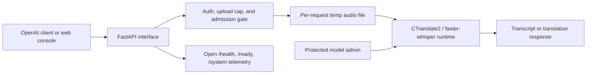

# Architecture overview

The server is a FastAPI application that fronts a CTranslate2 / faster-whisper
runtime, with an optional React web console served from the same process.

## Components

- **FastAPI interface** — routes the OpenAI-compatible endpoints, the operational
  endpoints (`/health`, `/ready`, `/system`), the model-admin endpoints, and the
  web console.
- **Auth and admission** — a router-level dependency enforces bearer auth on the
  protected routes; a process-wide admission gate bounds concurrency and queueing
  before any GPU work begins.
- **Runtime** — a single resident Whisper model loaded through
  faster-whisper/CTranslate2. Model loads and switches are serialized.
- **Web console** — static assets and a small config endpoint under `/web`,
  disabled with `ENABLE_WEB_UI=false`.

## Trust boundary

- **Open, non-PII surfaces**: `/health`, `/ready`, `/system`, and the web console
  static assets. These stay reachable during warmup and before a key is entered.
- **Protected surfaces**: `/v1/audio/*`, `/v1/models`, and `/api/model/*` require
  the bearer key when `API_KEY` is set. The auth check runs before the
  model-readiness check, so a missing key returns `401` even while warming.

Transcription runs fully locally; no request data is sent to any external service.

## Persistence boundary

- **Uploaded audio** lives only in a per-request temporary file and is deleted
  when the request ends (success, error, or cancellation). It is never durably
  stored.
- **Durable state** in `DATA_DIR` is limited to the generated TLS certificate
  (`<DATA_DIR>/tls`) and the active-model choice (`<DATA_DIR>/active_model`).
- **Model weights** are read from the baked `MODEL_DIR` or the Hugging Face cache;
  they are inputs, not request data.

## External dependencies

faster-whisper and CTranslate2 (inference), OpenAI Whisper model weights (as
converted to CTranslate2 by Systran), FastAPI and uvicorn (HTTP), and NVML for GPU
telemetry. All inference dependencies are self-contained in the image.

## Read next

- [Request lifecycle](./request-lifecycle.md) — a single transcription request end
  to end.
- [Model lifecycle](./model-lifecycle.md) — loading, warmup, switching, and
  persistence.
