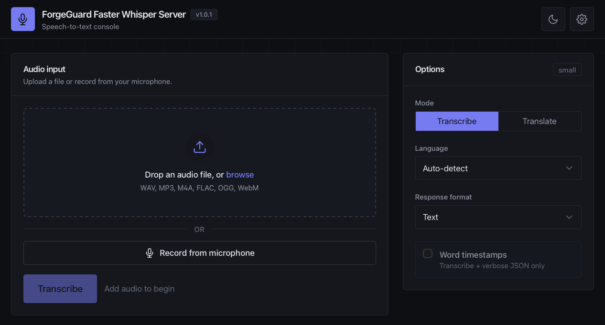

# ForgeGuard Faster Whisper Server

A container-native, OpenAI-compatible speech-to-text server built on
[faster-whisper](https://github.com/SYSTRAN/faster-whisper) and
[CTranslate2](https://github.com/OpenNMT/CTranslate2). Point any OpenAI audio SDK
at it and transcribe or translate on hardware you control — nothing about a
request leaves the container.

## What it is

- An HTTP service exposing `/v1/audio/transcriptions` and
  `/v1/audio/translations`, plus a small set of operational and admin routes.
- Distributed as **container images and a Helm chart only** — there is no
  supported bare-metal install path.
- Published for x86_64 NVIDIA GPUs (CUDA cu128) and NVIDIA Jetson Orin
  (JetPack 6), each baking a default Whisper model so there are no downloads at
  container start.
- Conservative with sensitive data by default: transcripts stay out of the logs,
  and uploaded audio lives only in a per-request temporary file.

## Where to start

### Run it

- [Quickstart](./getting-started/quickstart.md) — run a container, verify health
  and readiness, and make your first transcription request.
- [Container deployment](./deployment/container.md) — the single-container path
  with volumes, GPU flags, and environment.

### Integrate it

- [Transcription and translation](./concepts/transcription-and-translation.md) —
  how the endpoints, formats, and options behave.
- [OpenAI-compatible API reference](./reference/openai-api.md) — endpoints,
  parameters, and response schemas with examples.
- [Compatibility](./reference/compatibility.md) — what "OpenAI-compatible" means
  here, and where it differs from the OpenAI service.

### Operate it safely

- [Health and readiness](./operations/health-and-readiness.md) — the liveness and
  readiness contract for orchestrators.
- [Observability and queues](./operations/observability-and-queues.md) — the
  `/system` telemetry and the admission queue.
- [Security hardening](./operations/security-hardening.md) — authentication,
  TLS, upload limits, and container hardening.
- [Privacy and responsible use](./concepts/privacy-and-responsible-use.md) — how
  audio and transcripts are handled, and your obligations as an operator.

### Understand models and data handling

- [Model selection](./concepts/model-selection.md) — choose, provision, activate,
  and persist a Whisper model.
- [Architecture overview](./architecture/overview.md) — components, request
  lifecycle, and model lifecycle.

## Deployment methods

| Method | Intended use | Guide |
|---|---|---|
| Container | Local testing and single-service deployment | [Container](./deployment/container.md) |
| Docker Compose | Durable single-host operation | [Compose](./deployment/compose.md) |
| Portainer | Managed remote Docker environments | [Portainer](./deployment/portainer.md) |
| Kubernetes (Helm) | Cluster and production deployment | [Kubernetes](./deployment/kubernetes.md) |
| Jetson Orin | Edge / on-device deployment | [Hardware profiles](./deployment/hardware-profiles.md) |

## Project status

Current release **1.1.0**. Versioned releases and immutable container tags are
recommended for persistent deployments; `:latest` tracks the newest stable
release. Real-time streaming and additional inference backends (AMD ROCm, Intel)
are planned but **not yet available**. See [Upgrades](./operations/upgrades.md)
for the release and tagging policy.
